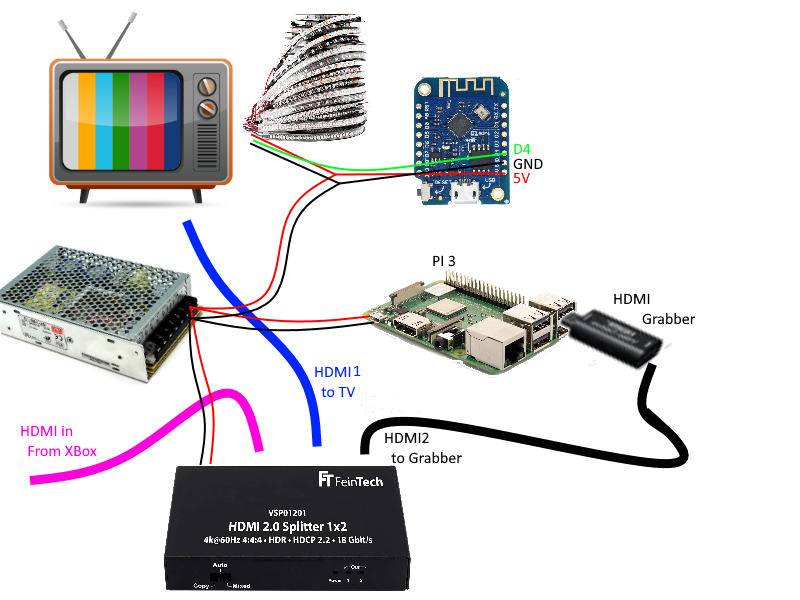

If this help you, consider to  

# hyperion-ambilight-howto

Hello there! Have you ever heard of ambilight?

Ambilight is a technology developped by Philips to add an ambient light 
around the screen of a TV that "extends" the image that's on your screen.

Even if the "ambilight" is only possible to have on a philips "ambilight" tv, 
you can have an ambient lighting on any screen thanks to a few components, 
Hyperion and some HDMI cables.

## Parts list:
- a Raspberry Pi (I used an old Pi3 B that I had laying around.) ~35€
- a D1 Mini (to control your LED strip) ~2-3€
    - I used this one: https://fr.aliexpress.com/item/32643142716.html
- a WS2812B Led strip (enough lenght to circle around the back of your TV) ~20€
    - I ordered this one: https://fr.aliexpress.com/item/32654279986.html  
- Some L shaped connectors for RGB strips (for an easy connection) ~2€
    - https://fr.aliexpress.com/item/32660050578.html
- a 5V power supply with enough power to feed your strip and some other components. ~10-12€
    - I ordered a 5V20A Power supply there: https://fr.aliexpress.com/item/32905696401.html
- a HDCP 2.2 compatible HDMI splitter. ~40€
    - I ordered this one: https://www.amazon.nl/dp/B07D6WYJTN
    - Please note that the HDCP 2.2 is important as some contents (such as blu-rays) might refuse to display themselves if your splitter isn't HDCP compliant.
- an HDMI to USB capture card ~10€
    - I used this one: https://fr.aliexpress.com/item/4001032586121.html 
- a HDMI switcher (not required)
    - I ordered this one: https://fr.aliexpress.com/item/32881007293.html ~40€
    
## Schema of the components:

The project can be splitted in two modules
### Image Capture module:
This module will capture the hdmi signal from your source and analyze it 
to determine the colors to put on the RGB strip. 
This step is achieved by [hyperion.ng](https://github.com/hyperion-project/hyperion.ng/releases) installed on the Raspberry pi. 
### Strip color control:
This module receives the colors from Hyperion and applies them on the strip. 
This step is achieved by [WLED](https://github.com/Aircoookie/WLED) installed on the D1 mini.

## How I did it:
This document won't give you a step by step of how to create you own ambilight 
but I will refer you to some videos that inspired me to create my own 
and will also provide you with a series of advices and mistakes I made.
### References:
- [Dr Zzs video on ambilight](https://www.youtube.com/watch?v=5_sO0yikwrs).
    - Event though Dr Zzs wires his led strip directly on the Pi, 
      I will send you to his channel beacause he has a lot of good content about home automation. (Check it out!)
    
- [MadeByMiro's 3-Part series](https://www.youtube.com/watch?v=EjD2ffiNXco)
    - I found this video very late in my researchs but this tutorial ends up being the closest of what I've done.
### Mistakes you don't want to reproduce:
- Placing your LED strip around the case of the TV instead of around the screen.
    - The first mistake I made is when placing the LED strip. 
      I placed them at the very edge of my TV but you want your sides to be 
      the same size as the screen of your TV instead of the size of the plastic border of your TV.
      *I do really hope this makes sense to you...*
      
- Going cheap and order a "dumb" HDMI splitter.
    - Even if you might think it should work with a 5€ HDMI splitter, 
      the film industry has a secret weapon called [HDCP](https://fr.wikipedia.org/wiki/High-bandwidth_Digital_Content_Protection). 
      HDCP is a software protection of digital contents displayed via HDMI (and DVI).
      To make things simple, HDCP works by verifying that every device on the HDMI network is "safe" 
      and can't be used to illegally copy the movies that the DVD/Blu-Ray/Disney+/... is sending through the HDMI cable.
      
      Even if the goal is understandable, this protection is [not frustrating just for pirates](https://www.techhive.com/article/2881620/4k-content-protection-will-frustrate-consumers-more-than-pirates-meet-hdcp-22.html).
      If you don't buy an HDCP 2.2 HDMI splitter like the one I linked above, 
      you'll likely end up with a DVD refusing to launch or the Error 39 on Disney+ (Netflix is ok though !)
    
## Description of my components:
At home I have:
- A Nintendo Switch
- A TV tuner (Proximus)
- A Steam Link
- A Google Chromecast (V1)
- An XBOX One.
- In the future maybe a Kodi

As i regularly use my XBox to steam content fom Netflix, watch DVDs and Blu-Rays or watch Disney+. 
I wanted to use it as a "hub".  

So, all my devices are connected to the HDMI switch. 

The output of this switch is then fed in the "Input" port of the XBox.

The "Output" of the XBox is then fed in the HDMI Splitter.

The Splitter (out1) goes to my TV

The Out2 goes in the HDMI Capture card plugged in the PI.

If you have any questions, feel free to open an issue. 
I will gladly answer to you as soon as possible 
and maybe improve this "How To" accordingly :-)